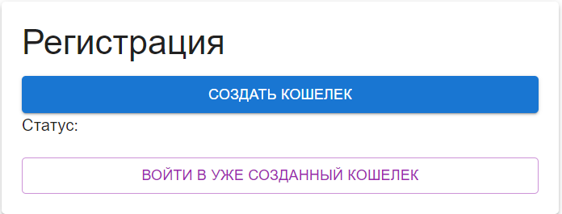
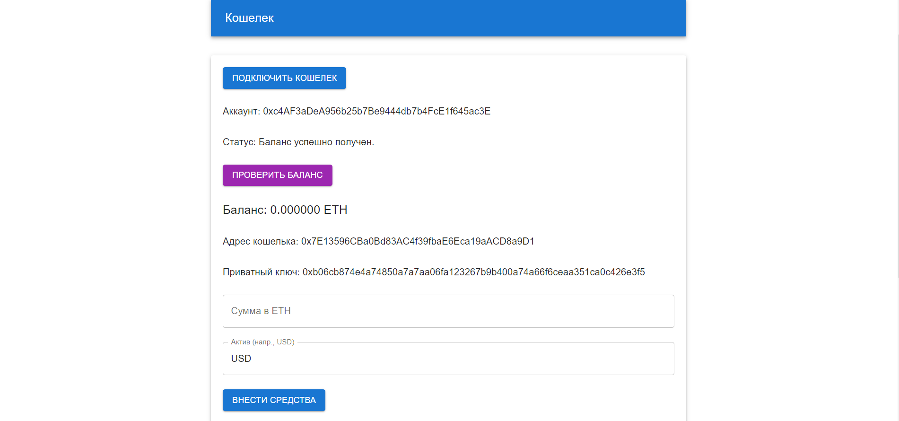
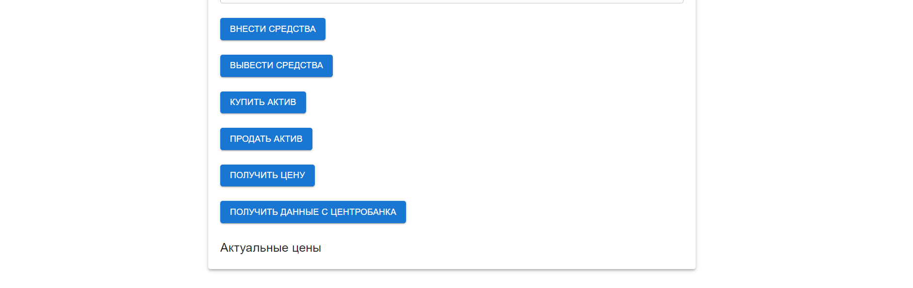

# Торговая система на Web 3

## Разработали:    Бейшембиев Э., Кононенко И.


Для запуска приложения необходимо:
1. Запустить сервер из директории ```/trading$ node server.js```
2. Запустить сайт из директории ```/trading$ npm start```

Работа приложения 
1. Экран регистрации
   


здесь присутствуют две кнопки "Создать кошелек" и "Войти в уже созданный кошелек".

- Для успешного нажатия кнопки "Создать кошелек" нужно быть зарегестрированным в MetaMask(зайти в свой профиль), затем придет транзакция на создание нового аккаунта. После этого откроется экран кошелька.
-  При нажатии "Войти в уже созданный кошелек" просмотрися локальное хранилище аккаунтов, если там будет аккаунт то он зайдет в последний использованный, если же нет то выкинет ошибку
2. Экран кошелька


- Кнопка подллючить кошелек - подключение последнего сохраннего кошелька.
- Статус - это текстовые сообщения об результатах нажатия тех или иных кнопок (сообщения об ошибках и успешных запросов).
- Кнопка проверить баланс - показывает баланс созданного кошелька.
- Адрес кошелька - адрес созданного кошелька.
- Поле для ввода "Сумма в ETH" - поле для ввода суммы (в ETH) для работы с транзакциями.
- Актив - поле для ввода активов для проверки стоимости или купли/продажи.
- Кнопка внести средства - транзакция для пополения нового кошелька.
- Кнопка вывести средства - транзакция для вывода денег с нового кошелька.
- Кнопка купить актив - транзакция для покупки актива.
- Кнопка продать актив - транзакция для продажи актива.
- Кнопка получить цену - вывод цены текущего актива из поля "Актив", для уточнения цены (данные покажутся после нажатия кнопки "Получить данные из ЦБР") сохранненые на сервере.
   Кнопка Получить данные из ЦБР - транзакция для получения данных из центробанка (при помощи оракула) 
- P.S. Обращаем ваше внимание на то, что данные вводятся долго надо подождать и что высокая стоимость газа при взаимодействии с данными из Центробанка является фактором, не зависящим от нас. Из-за этого не всегда удается сохранить информацию о всех активах. Мы прилагаем все усилия для оптимизации работы нашего сервиса, однако данный аспект может повлиять на своевременность и полноту обновлений данных.

## Лицензии проекта

### Лицензии для внешних данных
- [Open Data Commons Open Database License (ODbL)](https://opendatacommons.org/licenses/odbl/1-0/)
- [Creative Commons Attribution License (CC BY)](https://creativecommons.org/licenses/by/4.0/)

### Лицензии для программного обеспечения
- [MIT License](https://opensource.org/licenses/MIT)
- [GNU General Public License (GPL)](https://www.gnu.org/licenses/gpl-3.0.en.html)
- [Apache License 2.0](https://www.apache.org/licenses/LICENSE-2.0)
- [BSD License](https://opensource.org/licenses/BSD-3-Clause)

### Лицензии для библиотек и фреймворков
- [GNU Lesser General Public License (LGPL)](https://www.gnu.org/licenses/lgpl-3.0.html)
- [Eclipse Public License (EPL)](https://www.eclipse.org/legal/epl-2.0/)

### Лицензии для документации и материалов
- [Creative Commons Attribution-ShareAlike (CC BY-SA)](https://creativecommons.org/licenses/by-sa/4.0/)
- [Creative Commons Attribution-NoDerivs (CC BY-ND)](https://creativecommons.org/licenses/by-nd/4.0/)
